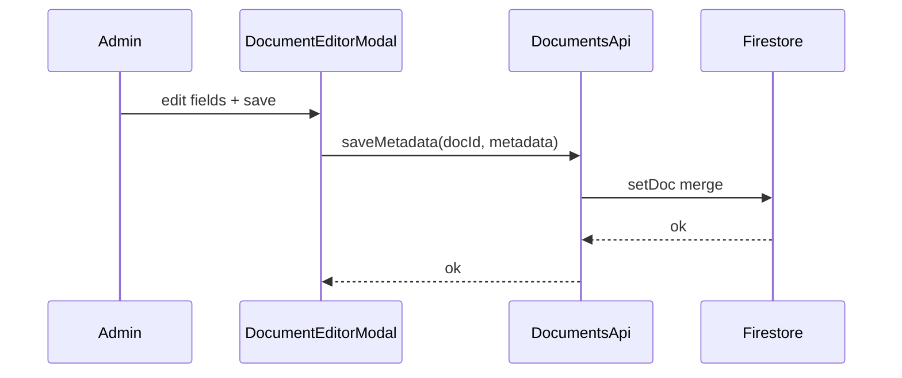
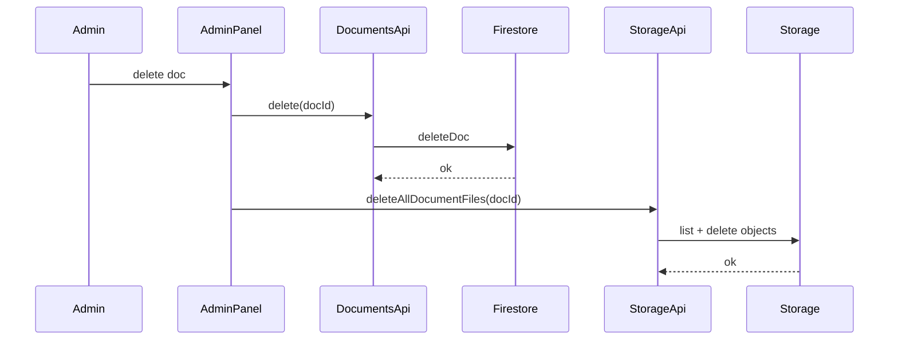
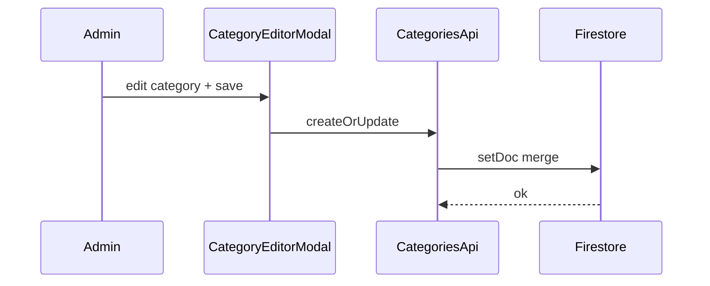
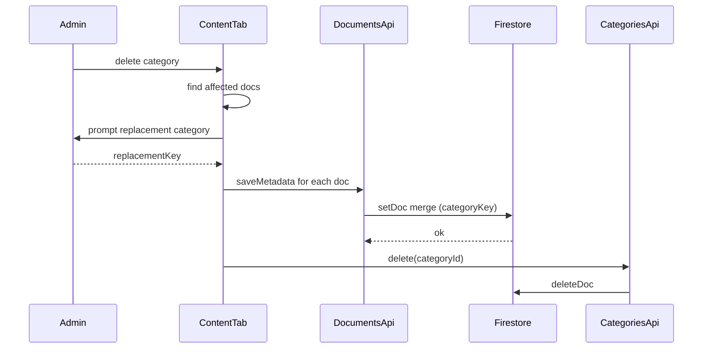
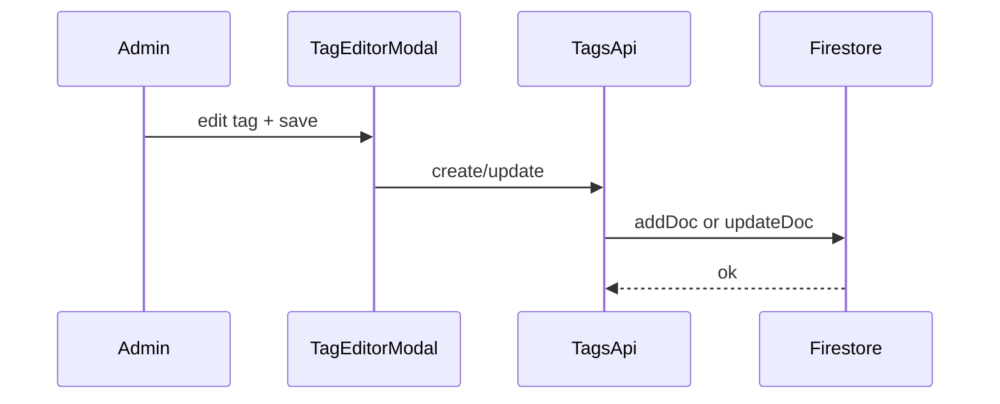
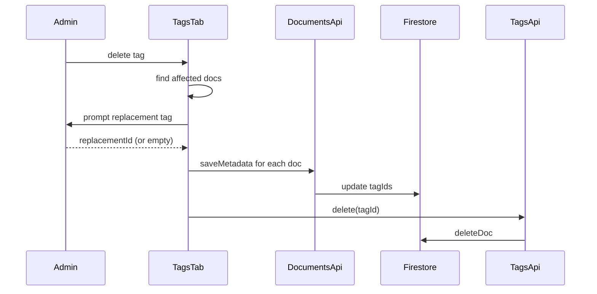
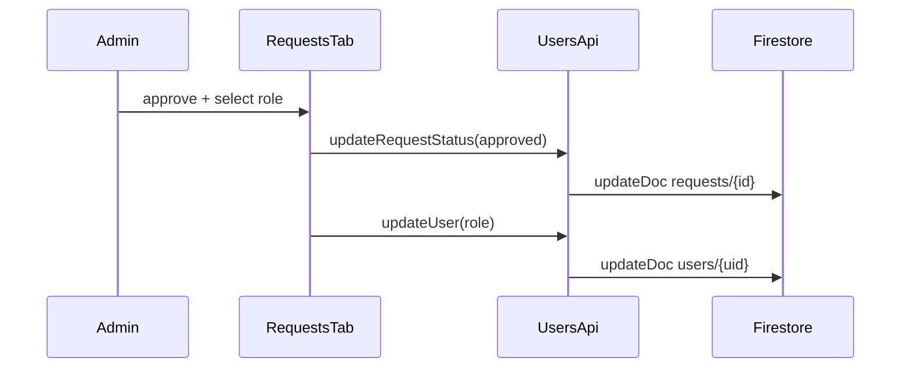
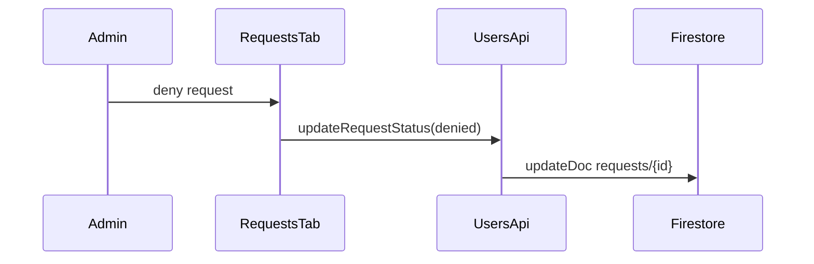
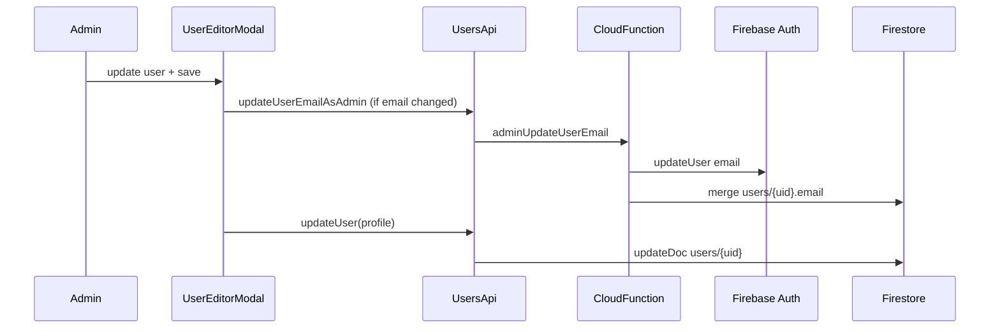
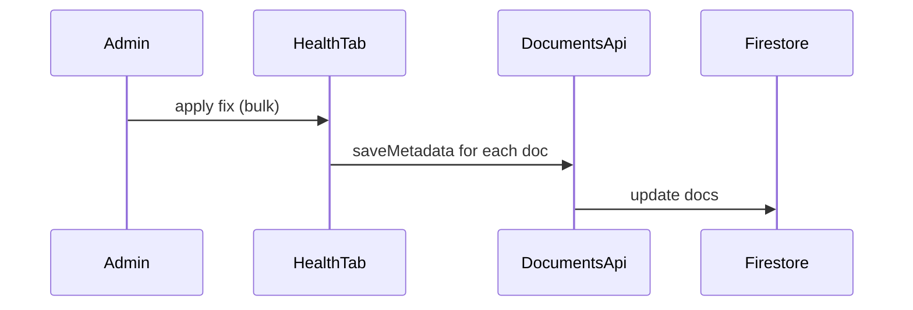

# Mermaid-діаграми: адмін-операції

## 1) Створення/редагування документа

## 2) Видалення документа

## 3) Створення/редагування категорії

## 4) Видалення категорії з міграцією

## 5) Створення/редагування тегу

## 6) Видалення тегу з міграцією

## 7) Approve request

## 8) Deny request

## 9) Редагування користувача (з email sync)

## 10) Health Tab Fix

