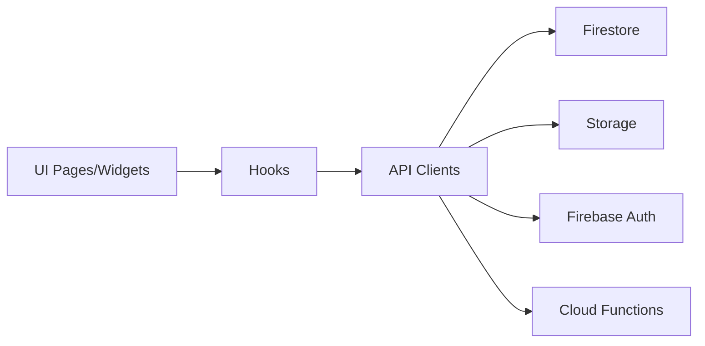
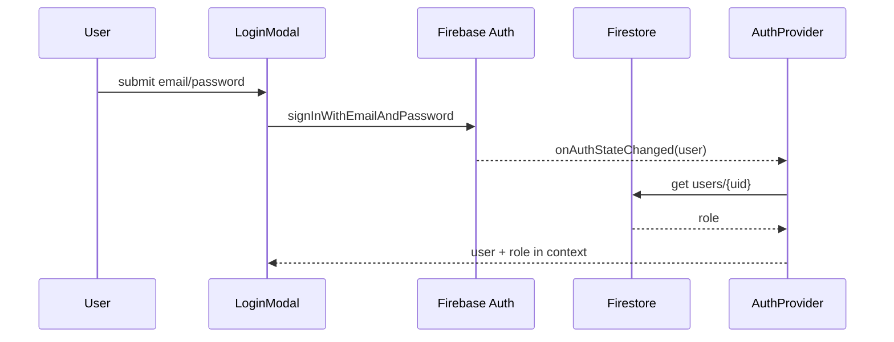
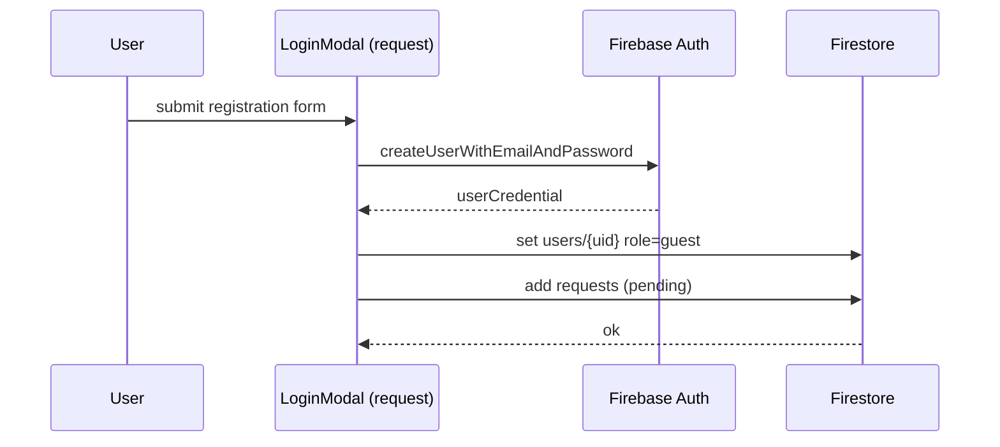
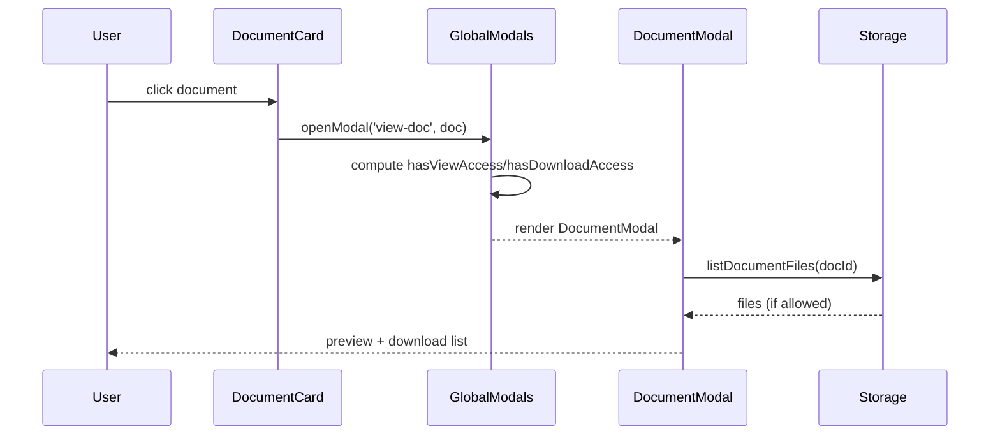
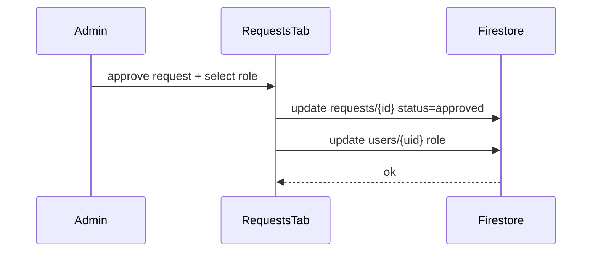
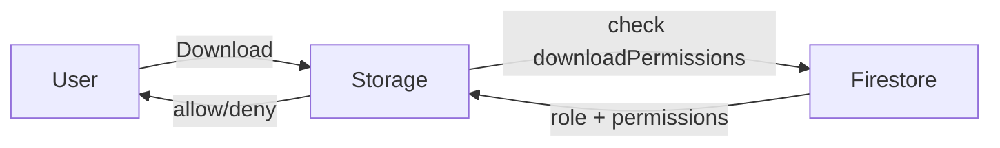

# Діаграми (Mermaid)

> Можна вставляти у Markdown/Notion/GitHub і Mermaid відрендерить граф.

## 1) Загальна архітектура



## 2) Логін / Отримання ролі



## 3) Реєстрація + заявка



## 4) Перегляд документа



## 5) Адмін: Approve request



## 6) Адмін: Масові зміни документів

```mermaid
flowchart TD
  A[Admin selects docs] --> UI[ContentTab bulk action]
  UI --> API[DocumentsApi.saveMetadata]
  API --> FS[Firestore documents/{id}]
  FS --> UI
```

## 7) Storage доступ



